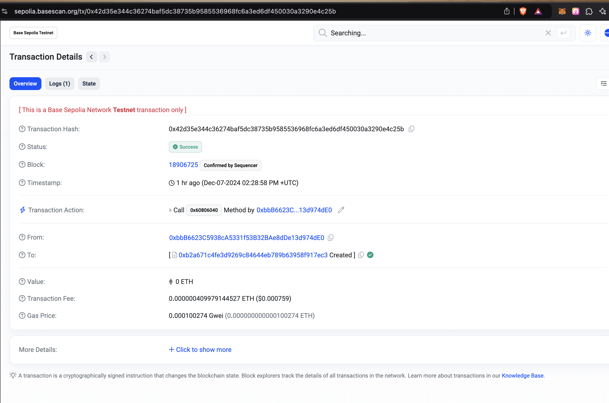
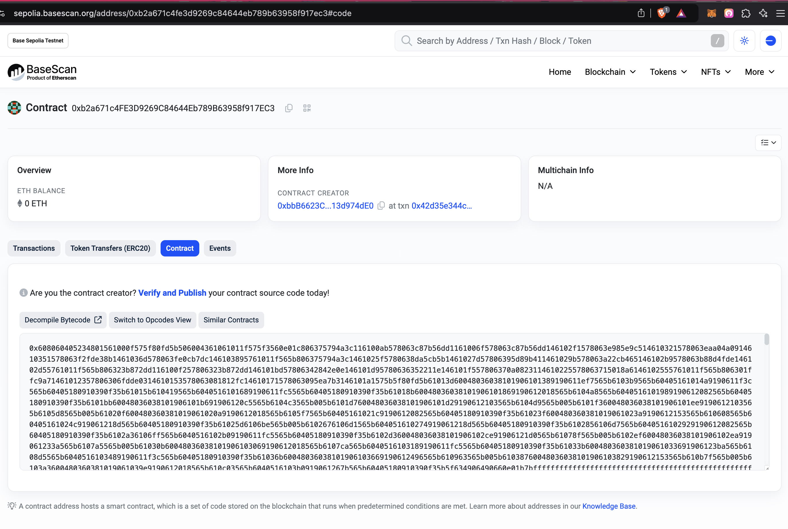
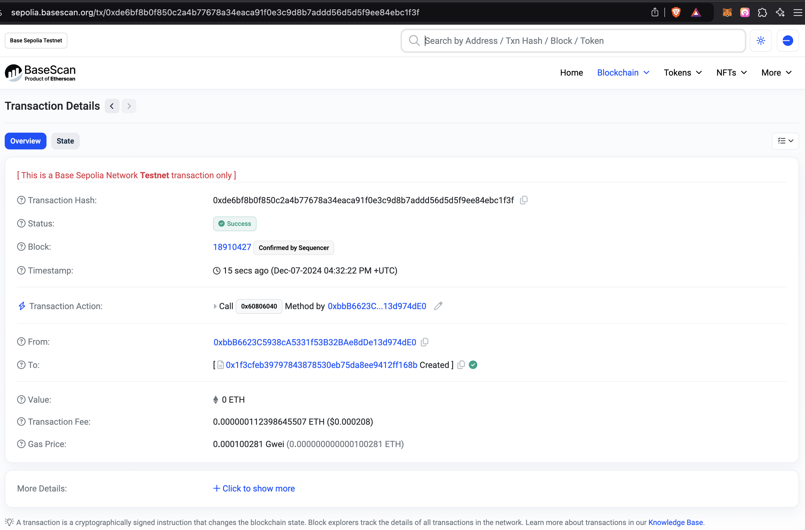
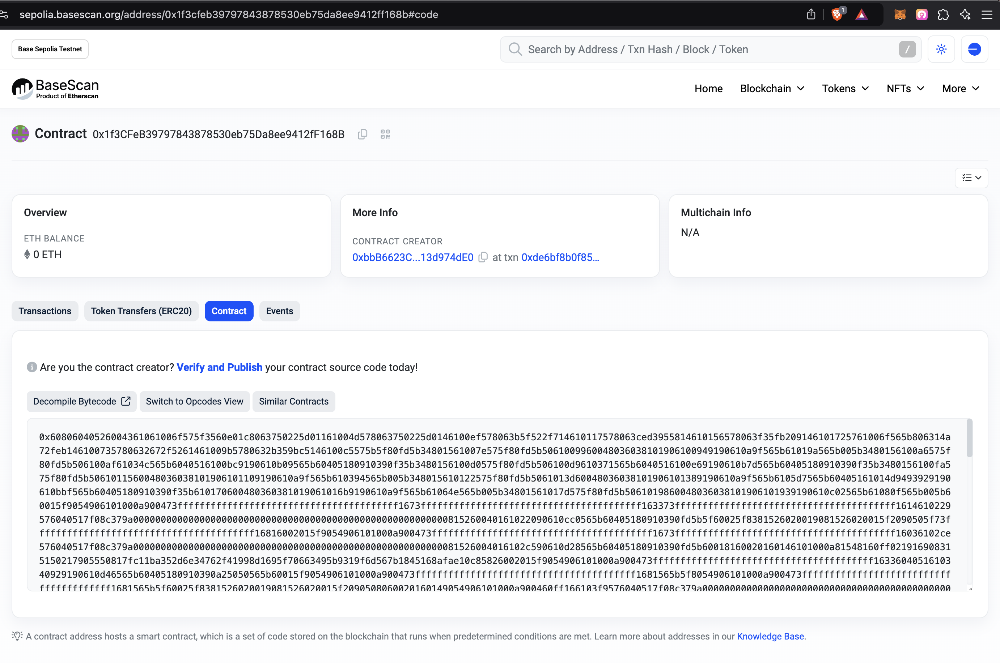

# land-nft-sol

This project implements a blockchain-based land marketplace where users can mint NFTs representing parcels of land, list them for sale, and perform transactions with the ability to view plots in a 3D interactive map. The smart contracts are written in Solidity, and they support minting land NFTs, buying and selling land, and allowing government approval of sales.

## Features

- **Mint Land NFTs**: Users can create NFTs representing land parcels by selecting points on the 3D map and minting corresponding NFTs.
- **Land Listing**: Users can list their land for sale by providing details and setting a price.
- **Buying Land**: Buyers can purchase listed land by agreeing to the price set by the seller.
- **Government Approval**: Before the final transfer of land, government approval is required for the transaction to proceed.
- **Marketplace**: A marketplace where users can interact with land NFTs to buy, sell, and transfer ownership.

## Table of Contents

- [Installation](#installation)
- [Contract Overview](#contract-overview)
- [Smart Contract Functions](#smart-contract-functions)
- [UI Features](#ui-features)
- [Interacting with the Contract](#interacting-with-the-contract)
- [License](#license)

## Installation

### Prerequisites

Ensure you have the following installed:
- [Node.js](https://nodejs.org/en/) (LTS version recommended)
- [Truffle](https://www.trufflesuite.com/truffle) for deploying smart contracts
- [Ganache](https://www.trufflesuite.com/ganache) for local Ethereum blockchain (or use other testnets like Rinkeby or Goerli)

### Setting up the Project

1. Clone the repository:
   ```bash
   git clone https://github.com/sreenikethMadgula/land-nft-marketplace.git
   cd land-nft-marketplace
   ```

2. Install dependencies:
   ```bash
   npm install
   ```

3. Compile the smart contracts:
   ```bash
   truffle compile
   ```

4. Migrate the smart contracts to your local blockchain (or a test network):
   ```bash
   truffle migrate --network development
   ```

## Contract Overview

This smart contract manages land plots as NFTs, allowing users to mint, buy, sell, and transfer ownership of land. The contract includes:

- **LandNFT**: Represents each plot of land as a unique token (NFT).
- **Marketplace**: Handles the buying and selling process of land, including listing and purchasing functionality.
- **Sale Approval**: Government approval is required before finalizing a sale.

### Smart Contracts

- **LandNFT.sol**: Handles the minting and transferring of land NFTs.
- **LandMarketplace.sol**: Manages the sale and listing of land for sale.
- **Governance.sol**: Defines the government approval process for land transactions.

## Smart Contract Functions

### 1. `mintLand(address owner, uint256 landId, string memory coordinates)`
- **Description**: Mint a new NFT for a plot of land with a unique ID and coordinates.
- **Parameters**:
  - `owner`: The address of the land owner.
  - `landId`: A unique identifier for the land plot.
  - `coordinates`: A string representing the geographical coordinates of the land.
- **Returns**: None

### 2. `listLand(uint256 landId, uint256 price)`
- **Description**: List a land NFT for sale with a price.
- **Parameters**:
  - `landId`: The ID of the land NFT.
  - `price`: The price of the land in wei.
- **Returns**: None

### 3. `buyLand(uint256 landId)`
- **Description**: Allows a user to buy a listed land NFT by paying the specified price.
- **Parameters**:
  - `landId`: The ID of the land NFT to buy.
- **Returns**: None

### 4. `approveSale(uint256 landId)`
- **Description**: Government approval for a sale. This function is required before completing a sale.
- **Parameters**:
  - `landId`: The ID of the land NFT to approve.
- **Returns**: None

### 5. `completeSale(uint256 landId)`
- **Description**: Finalize the sale of the land NFT after receiving government approval.
- **Parameters**:
  - `landId`: The ID of the land NFT to complete the sale.
- **Returns**: None

### Deployed Contracts
1. Base Sepolia Testnet
    - [LandNFT contract deployment txn](https://sepolia.basescan.org/tx/0x42d35e344c36274baf5dc38735b9585536968fc6a3ed6df450030a3290e4c25b)
    
    - [LandNFT deployed contract](https://sepolia.basescan.org/address/0xb2a671c4fe3d9269c84644eb789b63958f917ec3#code)
    - LandNFT deployed contract address - `0xb2a671c4fe3d9269c84644eb789b63958f917ec3`
    

    - [LandMarketplace contract deployment txn](0xde6bf8b0f850c2a4b77678a34eaca91f0e3c9d8b7addd56d5d5f9ee84ebc1f3f)
    
    - [LandMarketplace deployed contract](https://sepolia.basescan.org/address/0x1f3cfeb39797843878530eb75da8ee9412ff168b#code)
    - LandMarketplace deployed contract address - `0x1f3CFeB39797843878530eb75Da8ee9412fF168B`
    - 

## UI Features

The user interface (UI) provides an interactive 3D map where users can:

- **View all available land plots**: A visual representation of all the land parcels on a 3D map, each with its corresponding NFT.
- **Select and create plots**: Users can select points on the map, define the boundary, and create a new plot of land. The corresponding NFT can be minted after defining the plot.
- **List Land for Sale**: After creating a plot, users can list it for sale by specifying the price.
- **Purchase Land**: Users can buy listed land by agreeing to the price and confirming the purchase.
- **Request Government Approval**: Sellers need to get government approval for a sale before it can be completed.
- **Complete Sale**: After government approval, the transaction can be finalized and ownership transferred.

### 3D Map Interaction

The 3D map lets users interact with the land plots in a more intuitive way:

- **Select Points**: Users can click on points to define the boundaries of a new land plot.
- **Visualize Ownership**: The map highlights the ownership of each plot, showing the owner’s address and relevant details.
- **Mint NFTs**: Once a plot is created, users can mint the NFT representing that plot.

## Interacting with the Contract

### 1. **Minting Land NFT**
- To mint a new plot, users can interact with the UI to select points and define the plot. The coordinates and other details are sent to the `mintLand` function in the smart contract.

### 2. **Listing Land for Sale**
- After minting the land NFT, users can list it for sale by calling the `listLand` function and providing the desired price.

### 3. **Buying Land**
- Buyers can browse the listed lands and use the `buyLand` function to purchase land.

### 4. **Approval from Government**
- The government needs to approve the sale before it can be completed. This is handled by the `approveSale` function.

### 5. **Completing the Sale**
- Once the government approves the sale, the `completeSale` function is used to finalize the transfer of land ownership.

## License

This project is licensed under the MIT License - see the [LICENSE](LICENSE) file for details.
